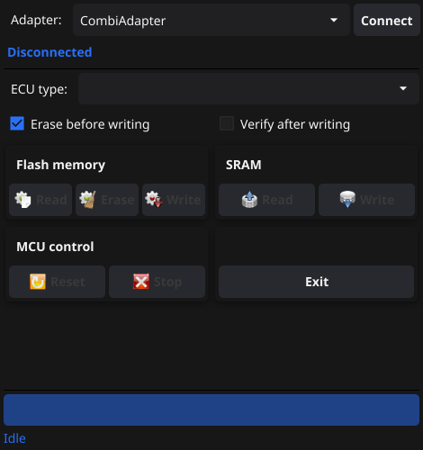

# BDMTool



Reads and writes SAAB Trionic (and Volvo CEM) ECU flash and SRAM over BDM
(Background Debug Mode). A extended Go/Fyne version of Janis Silins' BDM Tool.

## Supported adapters

- CombiAdapter (incl. MkII and STM32 clones)
- USB BDM
- USB BDM MkII
- ardubdm (ATmega328PB over USB serial; one entry per serial port found at startup)

## Supported ECUs

- Trionic 5.2
- Trionic 5.5 (28F010 chips)
- Trionic 5.5 (AM29F010 chips)
- Trionic 7
- Trionic 8
- Volvo CEM

## Build and run

Requires Go and libusb-1.0 development headers (CombiAdapter and USB BDM use libusb).

```sh
go build -o bdmtool .
./bdmtool
```

To regenerate the screenshot above (renders offscreen, no display needed):

```sh
./bdmtool -screenshot screenshot.png
```

## Credits

- Go/Fyne port by Joakim "Roffe" Karlsson.
- Original BDM Tool v2.13 by Janis Silins, 2009-2016.
- Portions of code from BDM v0.90, Scott Howard, 1992.
- Flash routines transcribed from Just4Trionic (Sophie Dexter).

For non-commercial use only.

If you like the software please [donate](https://paypal.me/roffe84) 💕
