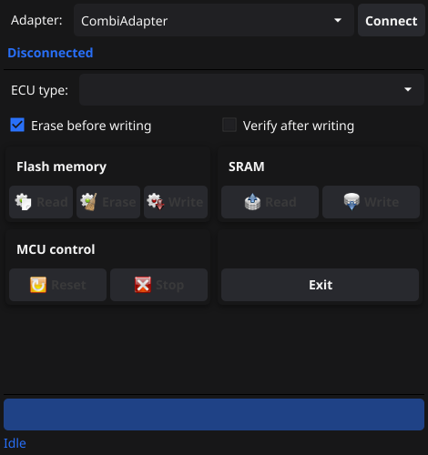
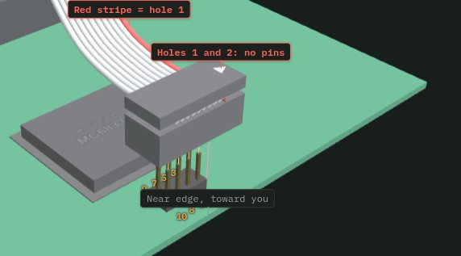
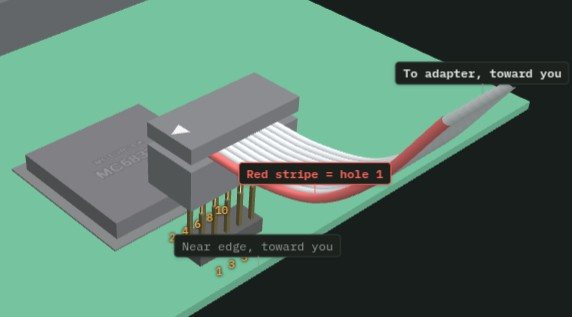

# BDMTool



Reads and writes SAAB Trionic (and Volvo CEM) ECU flash and SRAM over BDM
(Background Debug Mode). A extended Go/Fyne version of Jānis Silins' BDM Tool.

## Supported adapters

- CombiAdapter (incl. MkII and STM32 clones). The firmware version is read
  at connect. From CombiAdapter firmware 2.0, Identify ECU works, and erase
  and write run the same CPU32 flash drivers as ardubdm. Both use the
  firmware's block write (`0x4f`) and run until BGND (`0x50`). That covers the T5 28F010 erase and every
  28F010/29F write; an SRAM restore is a block write too. Firmware 1.x, the
  MkII and the clones keep the adapter's own `0x4c`/`0x4d` routines.
- USB BDM
- USB BDM MkII
- ardubdm (ATmega328PB over USB serial; one entry per serial port found at startup)
- bdmtoy (STM32F103, USB `ffff:0107`) on firmware 2.2 or later, old-style CPU32 BDM. See [bdmtoy](#bdmtoy).

## Supported ECUs

- Trionic 5.2
- Trionic 5.5 (28F010 chips)
- Trionic 5.5 (AM29F010 chips)
- Trionic 7
- Trionic 8
- Trionic 8 MCP (MC68F375 coprocessor, ardubdm only)
- MC68331
- Volvo CEM

### MC68331

The GM CANdi module: MC68331, one Am29F200B (256 KB) at 0 and two K6X1008
SRAMs (256 KB) at 0x100000. The chip-select and clock values come from the
module's own firmware, via bdmtoy's `initCandi()`. The flash is ordinary AMD
29Fxxx, so erase and write use the same routines as a Trionic 7; the CPU32
flash driver runs from the module's external SRAM, because the 68331's
internal TPU RAM would have to be mapped on top of it. Not yet bench-verified.

### Trionic 8 MCP

The MCP's flash, SRAM and DPTRAM are all on the MC68F375 itself and are
unmapped after a reset into BDM, so connecting maps them and takes the PLL to
24 MHz. The image is 256 KB + the 256-byte shadow row, 0x40100 bytes, the
shadow last -- the same layout bdmtoy uses. There is no command interface in
the array: every program and erase pulse is timed by a CPU32 driver uploaded
to DPTRAM (`driver/cmfi` in the ardubdm repo, vendored from bdmtoy, embedded
here as `cpu32cmfi.bin`). That driver is why the MCP works on ardubdm only;
the CombiAdapter and USB BDM program flash in their own firmware and refuse
this ECU. Not yet bench-verified.

## Build and run

Requires Go and libusb-1.0 development headers (CombiAdapter, USB BDM and bdmtoy use libusb). On Linux the Fyne/GLFW build also needs the X11 and Wayland development headers (`xorg-dev libwayland-dev libxkbcommon-dev` on Debian/Ubuntu); build with `-tags=x11` or `-tags=wayland` to compile only one backend.

```sh
go build -o bdmtool .
./bdmtool
```

To regenerate the screenshot above (renders offscreen, no display needed):

```sh
./bdmtool -screenshot screenshot.png
```

## Embedding

The tool is package `github.com/roffe/bdmtool/bdm`, a Fyne widget; `main.go`
is just the standalone window around it. To host it in another Fyne app:

```go
ui := bdm.New(&bdm.Config{
	Window:   win,                                       // dialogs open over it
	OpenFile: func(ext string, fn func(path string)) {}, // host's native pickers
	SaveFile: func(name, ext string, fn func(path string)) {},
	OnExit:   func() { /* close the panel */ },
})
// place ui anywhere a fyne.CanvasObject goes; call ui.Disconnect() when it closes.
```

The firmware upload entries are only in `ui.Menu()`. One instance per process.

## bdmtoy

BDM Tool needs bdmtoy **firmware 2.2 or later**, and refuses older firmware
at connect. Compared with the upstream firmware it fixes old-BDM reads of
slow memory, address 0, BDM reset and halt, and a USB hang; adds a USB
bootloader; keeps BKPT pulled up while idle, so an ECU powered up with the
dongle on it does not come up halted; and is a plain vendor USB device that
Windows installs WinUSB for by itself. It comes from the bdmtoy repository
(`firmware/`, see its `firmware/README.md`).

Coming from the upstream firmware, flash `bin/bdmtoy-full.hex` (bootloader and
app) over SWD once: ST-LINK with `make flash`, or STM32CubeProgrammer,
BOOT0 = 0. After that, Firmware → bdmtoy updates it over USB (see
[Adapter firmware](#adapter-firmware)).

bdmtoy is driven over libusb, as its own host does. On Linux it needs a udev
rule for access:

    ACTION=="add", SUBSYSTEM=="usb", ATTR{idVendor}=="ffff", ATTR{idProduct}=="0107", GROUP="uucp", MODE="0660", TAG+="uaccess"

and one more for its bootloader, which firmware updates go through:

    ACTION=="add", SUBSYSTEM=="usb", ATTR{idVendor}=="ffff", ATTR{idProduct}=="0108", GROUP="uucp", MODE="0660", TAG+="uaccess"

On Windows the dongle and its bootloader both get the WinUSB driver by
themselves (Microsoft OS 2.0 descriptors), so there is no Zadig step.

Bench-tested on a Trionic 7: Identify and Info, read flash (512 KB in 2.1 s),
erase and write (11 s), and SRAM read and write. The BDM clock is 1 MHz out
of reset and for the prep table, then 6 MHz once the prep has set the CPU
clock to 16 MHz or more (T5, T7, MC68331); otherwise (T8) it stays at 1 MHz.
Trionic 5 and 8 are untested on it; the MCP is ardubdm only.

- Stop halts a running ECU through BKPT without resetting it, so Info shows
  the ECU's own setup. Every flash operation still resets into BDM first, so
  the prep table gets the write-once registers.
- SRAM is reached after that reset, through the prep's chip selects. Only the
  Trionic 7 is set up for it: its SRAM also needs the power latch at
  `0xFFF706`, which its own code would set.

`BDMTOY_HW=1 BDMTOY_REF=$PWD/flash.bin go test ./bdm -run HardwareToy -v`
runs Info, Identify, a flash dump compared against the reference, and an SRAM
read against a connected bdmtoy. `BDMTOY_WRITE=$PWD/image.bin` also erases
and writes that image first. `BDMTOY_UPDATE=1 go test ./bdm -run HardwareToyUpdate -v`
updates the dongle with the built-in firmware.

## Credits

- Go/Fyne port by Joakim "Roffe" Karlsson.
- Original BDM Tool v2.13 by Jānis Silins, 2009-2016.
- Portions of code from BDM v0.90, Scott Howard, 1992.
- Flash routines transcribed from Just4Trionic (Sophie Dexter).
- Trionic 8 MCP setup and its CMFI flash driver from bdmtoy.

For non-commercial use only.

If you like the software please [donate](https://paypal.me/roffe84) 💕


## Adapter firmware

The Firmware menu flashes the firmware images built into BDM Tool.

- **Upload ArduBDM** writes the ardubdm firmware to the board on the selected
  serial port.
- **CombiAdapter → 1.1 (legacy)** / **2.2 (latest)** writes CombiAdapter
  firmware over the adapter's USB bootloader. It takes 10 to 15 seconds and
  the adapter restarts when it is done. On Windows, 2.1 and later need no Zadig:
  Windows installs WinUSB for them on their own. 2.2 gives each adapter its own
  USB serial number, so Windows can tell several apart. Firmware 2.0 and later reboot into
  the bootloader on request. Older firmware can't, so the upload asks you to
  unplug the adapter and plug it back in, waits up to 30 seconds for that, and
  catches the bootloader in the 4 seconds it runs after power-up. The bootloader itself is never
  overwritten, so a failed upload can always be repeated. Only the original
  LPC1768 CombiAdapter is supported; STM32 clones are refused.
- **CombiAdapter → Bootloader + 2.2 (latest)** replaces the adapter's
  bootloader with bootloader 2.0, then writes 2.2 through it. Bootloader 2.0
  flashes firmware in about a second, and hands USB over to the firmware
  without the adapter dropping off the bus. It first uploads bootloader 2.0's
  installer as the firmware, the same way as above. The installer then writes
  the new bootloader, erases itself and restarts the adapter, and bootloader 2.0
  waits, with no time limit, for the firmware that follows. Keep the adapter
  plugged in: if it loses power during the half second the bootloader is
  written, it can only be recovered over SWD or the LPC17xx ROM ISP. If the
  flow stops after the install, the adapter stays in bootloader 2.0 and
  **2.2 (latest)** finishes the job. Running it again on bootloader 2.0 only
  rewrites the firmware.
- **bdmtoy → 2.2 (latest)** writes bdmtoy firmware over its USB bootloader (firmware
  2.0 or later, see [bdmtoy](#bdmtoy)) in about 7 seconds, then reports the
  version it restarted with. An update that is cut off leaves the dongle in
  its bootloader, so it can be repeated. If the dongle does not show up at
  all, set its BOOT1 jumper to 1 and plug it in to keep it in the bootloader.

## Identify ECU

With an ardubdm, a bdmtoy, or a CombiAdapter on firmware 2.0 or later,
connected, the "Identify ECU" button first halts the running
ECU and decodes its 68332 SIM registers into the log: CPU clock from SYNCR
(16.78 MHz on a prepped T7), the reason for the last reset (RSR: power-on,
external, watchdog, halt after a double bus fault, loss of clock), watchdog
and bus monitor settings (SYPCR), and the chip-select memory map (base, size,
read/write, byte lanes, wait states). If the ECU cannot be halted it resets
into BDM and reports the reset defaults, saying so.

It then resets into BDM and reads the flash chip IDs the way Just4Trionic
does (a 68377 CPU is reported as Trionic 8 before any flash probe): 29F400 =
Trionic 7, a pair of 28F010 or 29F010 = Trionic 5.5, a pair of 28F512 =
Trionic 5.2 (AMD, Intel and Catalyst 28F parts). A T5.2 fitted with 28F010
chips identifies as Trionic 5.5 (28F010 chips), since that is the flash it
has. Write flash repeats a file smaller than the flash to
fill it, as bdmtoy does, so a 128 KB T5.2 bin goes onto those chips twice:
the CPU boots from one half and runs the code from the other. With either
adapter, writing any Trionic 5 type first reads the chip IDs and switches to the type
the chips match, as bdmtoy sizes its writes from the chips: picking Trionic
5.2 by hand on such a box would write only the upper half and leave the one
it boots from blank. The matching ECU type is selected and the chips are logged, and
the ECU is then reset and left running its own code (with BDM enabled), so a
second Identify shows its real configuration rather than the probe's.

`ARDUBDM_PORT=/dev/ttyACM1 go test -run Hardware -v` runs the same against a
connected adapter from the command line.

## Connecting

The ardubdm PCB has a shrouded 2x5 box header with the standard CPU32 BDM pinout 

    | BDM pin | Signal      | Arduino |
    |---------|-------------|---------|
    | 1       | DS          | D8      |
    | 2       | BERR        | D6      |
    | 3       | GND         | GND     |
    | 4       | BKPT/DSCLK  | D5      |
    | 5       | GND         | GND     |
    | 6       | FREEZE      | D4      |
    | 7       | RESET       | D7      |
    | 8       | IFETCH/DSI  | D3      |
    | 9       | VDD         | A0      |
    | 10      | IPIPE/DSO   | D2      |

The 10-way IDC cable is wired 1:1; the red stripe is pin 1. At the
adapter the plug only fits one way.

`3d/index.html` is an interactive 3D view of the plug on the T5 and T7
headers; open it in a browser (it loads three.js from a CDN).

The T7 has the same standard 2x5 header, all ten pins present (BERR on pin 2
is wired to the MCU), so the plug goes on pin for pin. 

The T5 has pins 1 and 2 unused, so there one column of plug holes stays empty: **holes 1 and 2, the
column at the red stripe**, and holes 3-10 go on the pins. Numbers below are
the plug's holes, in parentheses = empty, hanging next to the header.

Hold the ECU with the BDM header side towards you: the big edge connector
and its heatsink at the far edge, the CPU (the large square chip) near you,
and the BDM header just below the CPU at the near edge. T5 and T7 look the
same in this respect.

```
   +----------------------------------------------------+
   |##### edge connector / heatsink (far edge) ##########|
   |                                                     |
   |                +-----------+                        |
   |                |   68332   |                        |
   |                |    CPU    |                        |
   |                +-----------+                        |
   |                 o o o o o                           |
   |                 o o o o o  <- BDM                   |
   +----------------------------------------------------+
                   near edge, towards you
```

### Trionic 5

Ribbon leaves **upwards**. Empty holes 1 and 2 on the **right**. Same plug,
turned half a turn compared with the T7:



```
      ribbon up
        |||||
        |||||
     9  7  5  3  (1)    <- odd row, red stripe at hole 1
    10  8  6  4  (2)    <- even row
    ^^^^^^^^^^^   ^
  on the 2x4 header  empty
```

### Trionic 7

Ribbon leaves **downwards**. All ten holes on the pins, red stripe on the
**left**:



```
    2  4  6  8  10      <- even row
    1  3  5  7   9      <- odd row, red stripe at hole 1
    ^^^^^^^^^^^^^^
        |||||
        |||||
     ribbon down
```

### Trionic 8

```
10 9
 8 7
 6 5
 4 3
 2 1
```

### Trionic 8 MCP

```
 2 4 6 8 10
 1 3 5 7 9
```